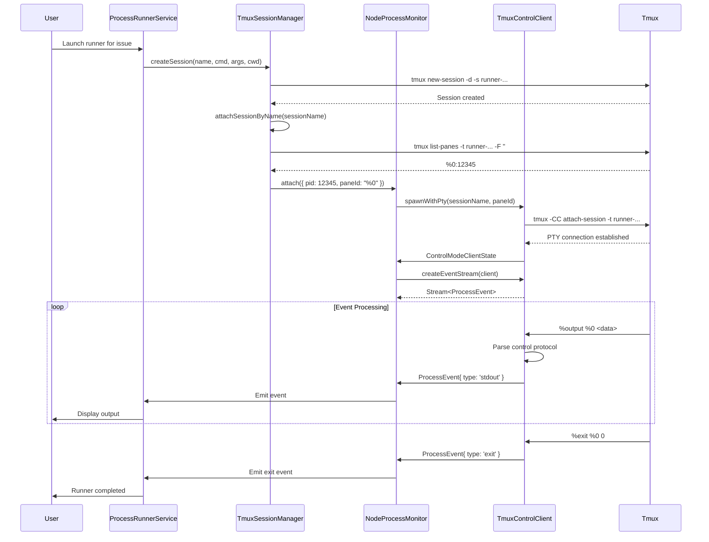

# Tmux Architecture: Control Client vs Session Manager

## Overview

The tmux integration uses a **layered architecture** with clear separation of concerns:

```
┌─────────────────────────────────────────────────────────┐
│          ProcessRunnerService (Domain Logic)            │
│              - Business logic                           │
│              - Lifecycle management                     │
└────────────────────┬────────────────────────────────────┘
                     │
         ┌───────────┴───────────┐
         │                       │
         ▼                       ▼
┌────────────────────┐  ┌────────────────────────┐
│ TmuxSessionManager │  │ NodeProcessMonitor     │
│    (HIGH-LEVEL)    │  │   (LOW-LEVEL I/O)      │
│                    │  │                        │
│  - Create sessions │  │  - Spawn processes     │
│  - Attach sessions │  │  - Stream events       │
│  - List sessions   │  │  - Monitor PIDs        │
│  - Get pane info   │  │  - Kill processes      │
└─────────┬──────────┘  └─────────┬──────────────┘
          │                       │
          │              ┌────────┴────────┐
          │              │                 │
          │              │   Uses:         │
          │              ▼                 ▼
          │     ┌────────────────┐  ┌──────────────┐
          │     │ TmuxControl    │  │  node-pty    │
          │     │    Client      │  │  (PTY I/O)   │
          │     │                │  │              │
          └────►│  - Parse -CC   │  │  - Terminal  │
                │  - Event parse │  │  - Real PTY  │
                │  - PTY wrapper │  │              │
                └────────────────┘  └──────────────┘
```

---

## 1. TmuxSessionManagerAdapter (High-Level Session Management)

**Location:** `src/main/process-runners/adapters/tmux-session-manager/tmux-session-manager-adapter.ts`
**Role:** Domain-level orchestration

### Responsibilities

#### A. Session Lifecycle (Create/Attach/List)

```typescript
createSession(name, command, args, cwd) {
  // 1. Build tmux command: tmux new-session -d -s <name> <command> <args>
  // 2. Execute via Command API
  // 3. Wait for creation to complete
  // 4. Attach to get ProcessHandle
  // 5. Return scoped handle
}

attachToSession(sessionName) {
  // 1. Verify session exists
  // 2. Get pane ID from tmux
  // 3. Get PID from pane
  // 4. Use NodeProcessMonitor to attach to PID
  // 5. Return ProcessHandle
}

listSessions() {
  // 1. Execute: tmux list-sessions
  // 2. Parse output into TmuxSession objects
  // 3. Return array of sessions
}
```

#### B. Dependency on NodeProcessMonitor

```typescript
export class TmuxSessionManagerAdapter extends Effect.Service<TmuxSessionManagerAdapter>()(
  'TmuxSessionManagerAdapter',
  {
    dependencies: [NodeProcessMonitorAdapter.Default], // ← Uses process monitor
    effect: Effect.gen(function* () {
      const processMonitor = yield* NodeProcessMonitorAdapter

      // Delegates actual process attachment/monitoring
      const handle = yield* processMonitor.attach(config)
    })
  }
)
```

**Key Point:** TmuxSessionManager **does NOT** do low-level I/O. It orchestrates tmux commands and delegates to NodeProcessMonitor for actual process tracking.

---

## 2. TmuxControlClient (Low-Level PTY Protocol Handler)

**Location:** `src/main/process-runners/adapters/tmux-session-manager/tmux-control-client-adapter.ts`
**Role:** Infrastructure utility (not a service!)

### Responsibilities

#### A. PTY-Based Tmux Control Mode

```typescript
// Uses node-pty to create a REAL pseudo-terminal
spawnWithPty(sessionName, targetPaneId) {
  // 1. Spawn: tmux -CC attach-session -t <session>
  // 2. Create PTY with node-pty (not child_process!)
  // 3. Return ControlModeClientState
}
```

**Why PTY?**
- Tmux `-CC` (control mode) requires a PTY to work properly
- Regular `child_process.spawn()` doesn't provide a TTY
- PTY enables real-time, unbuffered output

#### B. Event Stream Parsing

```typescript
createEventStream(client) {
  // Parses tmux control mode protocol:
  // %output <pane> <data>     → stdout event
  // %exit <pane> <code>       → exit event
  // %layout-change            → ignored
  // %session-changed          → ignored

  return Stream.fromAsyncIterable(parseControlModeProtocol())
}
```

**Protocol Example:**
```
%begin 1731447839 23 0
%output %0 hello world
%end 1731447839 23 0
%exit %0 0
```

#### C. Namespace Pattern (Not a Service!)

```typescript
export namespace TmuxControlClient {
  export const spawnWithPty = (...) => Effect<...>
  export const createEventStream = (...) => Stream<...>
}
```

**Key Point:** This is a **utility namespace**, not an Effect.Service. It's used by NodeProcessMonitor as a helper.

---

## 3. How They Work Together

### Scenario: User clicks "Launch Runner for Issue #42"

#### Step 1: Session Creation (TmuxSessionManager)

```typescript
// ProcessRunnerService calls:
const handle = yield* tmuxManager.createSession(
  'runner-claude-code-abc123',
  'bash',
  ['-c', 'claude work on issue #42'],
  '/workspace/issue#42'
)
```

**TmuxSessionManager executes:**
```bash
tmux new-session -d -s runner-claude-code-abc123 \
  -c /workspace/issue#42 \
  bash -c 'claude work on issue #42'
```

#### Step 2: Attach for Monitoring (TmuxSessionManager → NodeProcessMonitor)

```typescript
// TmuxSessionManager.attachSessionByName() runs:

// 1. Get pane info
const paneInfo = yield* executeTmuxCommand(
  `tmux list-panes -t runner-claude-code-abc123 -F "#{pane_id}:#{pane_pid}"`
)
// Output: "%0:12345"

// 2. Parse pane ID and PID
const paneId = '%0'
const pid = 12345

// 3. Delegate to NodeProcessMonitor
const handle = yield* processMonitor.attach({
  pid,
  name: 'runner-claude-code-abc123',
  paneId,  // ← Special: tells monitor to use tmux -CC
})
```

#### Step 3: Event Streaming (NodeProcessMonitor → TmuxControlClient)

```typescript
// NodeProcessMonitor.attach() with paneId set:

// Option A: Try PTY-based control mode (PREFERRED)
const controlClient = yield* TmuxControlClient.spawnWithPty(
  sessionName,
  targetPaneId
)

const eventStream = TmuxControlClient.createEventStream(controlClient)

// Fork stream processor
yield* Effect.forkIn(
  eventStream.pipe(
    Stream.tap((event) => {
      // Map pane events to ProcessEvents
      yield* emitEvent(handle.id, event)
    }),
    Stream.runDrain
  ),
  controlScope
)
```

**What happens:**
1. **TmuxControlClient.spawnWithPty()** creates: `tmux -CC attach-session -t runner-claude-code-abc123`
2. PTY captures raw tmux control protocol
3. **TmuxControlClient.createEventStream()** parses:
   - `%output %0 <data>` → `ProcessEvent{ type: 'stdout', data }`
   - `%exit %0 0` → `ProcessEvent{ type: 'exit', code: 0 }`
4. Events flow to ProcessRunnerService → Frontend

#### Step 4: Fallback (If PTY fails)

```typescript
// Option B: FIFO + pipe-pane (LEGACY)
const fifoPath = '/tmp/tmux-pipe-xyz/pane.fifo'

// Create FIFO
yield* Command.start(Command.make('mkfifo', fifoPath))

// Tell tmux to pipe pane output to FIFO
yield* executeTmuxCommand(
  `tmux pipe-pane -t ${targetPane} 'dd bs=1 of=${fifoPath} 2>/dev/null'`
)

// Read from FIFO
const fifoStream = Fs.createReadStream(fifoPath)
// ... convert to ProcessEvents
```

---

## 4. Architectural Benefits

### Separation of Concerns

| Component | Knows About | Doesn't Know About |
|-----------|-------------|-------------------|
| **TmuxSessionManager** | Tmux commands, sessions, panes | PTY, control protocol, FIFO |
| **TmuxControlClient** | PTY, control protocol | Sessions, domains, business logic |
| **NodeProcessMonitor** | PIDs, child processes, event streaming | Tmux specifics |

### Dependency Graph

```
ProcessRunnerService
    │
    ├─► TmuxSessionManager
    │       └─► NodeProcessMonitor ◄───┐
    │                │                 │
    │                └─► TmuxControlClient (utility)
    │
    └─► NodeProcessMonitor (for direct spawns)
```

### Hexagonal Architecture

- **TmuxSessionManager** = Adapter for tmux (could swap with `ScreenSessionManager`)
- **NodeProcessMonitor** = Adapter for Node.js processes (could swap with `DockerProcessMonitor`)
- **TmuxControlClient** = Infrastructure utility (protocol handler)

---

## 5. Key Design Decisions

### Why TmuxControlClient is a Namespace, not a Service?

```typescript
// ❌ NOT a Service
export class TmuxControlClient extends Effect.Service<TmuxControlClient>()

// ✅ Just a utility namespace
export namespace TmuxControlClient {
  export const spawnWithPty = ...
  export const createEventStream = ...
}
```

**Reason:** It's a **protocol parser**, not a domain service. NodeProcessMonitor uses it as a helper, doesn't need DI.

### Why PTY-based Control Mode?

```typescript
// ❌ Regular spawn (no PTY)
spawn('tmux', ['-CC', 'attach']) // ← tmux refuses, needs TTY

// ✅ node-pty (real PTY)
pty.spawn('tmux', ['-CC', 'attach']) // ← tmux sees real terminal
```

**Benefit:** Real-time events, no buffering, proper tmux protocol support.

### Why FIFO Fallback?

- PTY requires native `node-pty` module
- Some environments might not support it
- FIFO is portable Unix method (works anywhere tmux works)

---

## 6. Complete Flow Diagram



---

## Summary

| Component | Type | Purpose | Dependencies |
|-----------|------|---------|--------------|
| **TmuxSessionManager** | Adapter (Service) | Orchestrate tmux sessions | NodeProcessMonitor |
| **TmuxControlClient** | Utility (Namespace) | Parse tmux -CC protocol | node-pty |
| **NodeProcessMonitor** | Adapter (Service) | Low-level process I/O | TmuxControlClient (utility) |

**Flow:**
1. **TmuxSessionManager** creates session (high-level)
2. **NodeProcessMonitor** attaches to process (low-level)
3. **TmuxControlClient** handles PTY protocol (infrastructure)
4. Events flow: tmux → PTY → TmuxControlClient → NodeProcessMonitor → ProcessRunnerService → Frontend

This separation allows swapping implementations (tmux → screen, PTY → pipe, etc.) while keeping domain logic clean!

---

## File Locations

- **TmuxSessionManager**: `src/main/process-runners/adapters/tmux-session-manager/tmux-session-manager-adapter.ts`
- **TmuxControlClient**: `src/main/process-runners/adapters/tmux-session-manager/tmux-control-client-adapter.ts`
- **NodeProcessMonitor**: `src/main/process-runners/adapters/process-monitor/node-process-monitor-adapter.ts`
- **ProcessRunnerService**: `src/main/process-runners/services/process-runner-service.ts`

---

## Related Documentation

- **Hexagonal Architecture**: `docs/EFFECT_PORTS_AND_LAYERS_GUIDE.md`
- **Process Runners Domain**: See `src/main/process-runners/ports.ts` for port definitions
- **Effect Command API**: Used throughout for shell command execution
