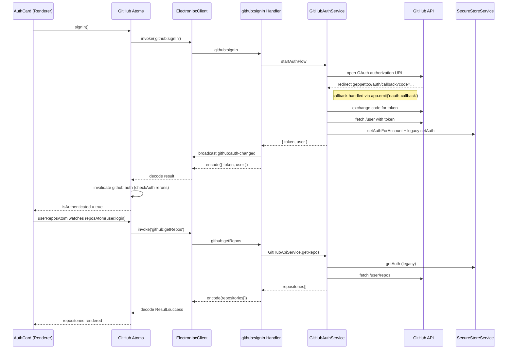

# Connect GitHub Flow (Current Branch)

## Renderer Entry Points

- `src/renderer/components/AuthCard.tsx`
  - Renders the `Connect GitHub` button (`line 48`) and flips to `Connecting…` while `signInAtom` is executing.
  - `onClick` calls `signIn` from `useGitHubAuth`, the only manual trigger for authentication on the renderer.
- `src/renderer/hooks/useGitHubAtoms.ts`
  - Exposes `signIn`/`signOut` by binding to `signInAtom`/`signOutAtom`.
  - Provides `isAuthenticated`/`currentUser` derived from atom state and a `refresh` helper (`useAtomRefresh`) used by `MainScreen` on broadcast events.
- `src/renderer/atoms/github-atoms.ts`
  - `signInAtom` executes `GitHubClient.signIn()` and invalidates the `github:auth` reactivity key so dependent atoms know to refetch.
  - `authStateAtom` calls `GitHubClient.checkAuth()` on boot and whenever `github:auth` is dirtied; it is `keepAlive` so the auth state is always resident.
  - `isAuthenticatedAtom`/`currentUserAtom` project `authStateAtom` into basic primitives for UI.
- `src/renderer/lib/ipc-client.ts`
  - `GitHubClient` delegates to `ElectronIpcClient.invoke`, which schema-validates the payload, calls `window.electron.ipcRenderer.invoke`, and decodes/throws typed `NetworkError`/`AuthenticationError`.
- `src/preload/index.ts`
  - Hardens the IPC bridge: exposes `ipcRenderer.invoke/on/removeListener` while stripping Electron’s raw event object. Renderer code can only access the IPC surface through this bridge.

## Main-Process Handlers

- `src/main/index.ts`
  - Builds the dependency layer (`GitHubAuthService`, `GitHubApiService`, `SecureStoreService`, `AccountContextService`) and runs `setupGitHubIpcHandlers` before creating any windows.
  - Registers the `geppetto://` protocol for OAuth callbacks on all platforms and re-emits them as `app.emit('oauth-callback', url)`.
- `src/main/ipc/github-handlers.ts`
  - Binds every `github:*` IPC channel to a domain service using shared schemas for input/output.
  - Wraps handlers with `mapDomainErrorToIpcError`, converting domain errors into contract-compliant `AuthenticationError`/`NetworkError` objects sent back to the renderer.
  - On `signIn`, broadcasts `github:auth-changed` with `{ user, token }`; on `signOut`, broadcasts the same event with `null`.
- `src/main/ipc/error-mapper.ts`
  - Collapses domain-specific errors (OAuth failures, rate limits, missing tokens) into the shared `errors` union defined for IPC contracts.

## OAuth Handshake Sequence

1. Renderer invokes `GitHubClient.signIn()` → IPC `github:signIn`.
2. `GitHubAuthService.startAuthFlow` (`src/main/github/auth-service.ts`)
   - Builds `https://github.com/login/oauth/authorize` with `client_id`, redirect `geppetto://auth/callback`, scopes, and a random state.
   - Opens the URL with `shell.openExternal`.
   - Registers a one-shot listener for the custom `oauth-callback` event using `Effect.async`.
3. Custom protocol callback returns from browser.
   - macOS: `app.on('open-url')` (`src/main/index.ts:216`) captures the redirect.
   - Windows/Linux: `app.on('second-instance')` (`src/main/index.ts:243`) reads the protocol URL from the command line.
   - Both paths call `app.emit('oauth-callback', url)` so the waiting effect can resolve.
4. `GitHubAuthService` validates the callback URL, extracts `code`, removes the listener, and resumes the effect.
5. Token exchange & user fetch (`src/main/github/http-service.ts`)
   - `exchangeCodeForToken(code)` posts to `https://github.com/login/oauth/access_token`, validates JSON with `GitHubTokenResponse`, and handles retriable failures with rate-limit-aware backoff.
   - `fetchUser(token)` hits `/user`, decodes against `GitHubUser`, and shares the same retry logic.
6. Account & token persistence
   - `AccountContextService.addAccount` adds/updates the GitHub account and makes it active.
   - `SecureStoreService.setAuthForAccount` stores the token in the new multi-account map (`githubTokens`).
   - **Legacy requirement**: `SecureStoreService.setAuth` still writes `githubToken`/`githubUser`—the rest of the app (notably `GitHubApiService`) still reads from these keys on this branch.
7. Handler resolves `{ token: Redacted<string>, user: GitHubUser }`, broadcasts `github:auth-changed`, and returns it to the renderer.

## Auth State Propagation Back to the Renderer

- `signInAtom` marks `github:auth` dirty, so `authStateAtom` re-runs `GitHubClient.checkAuth()` (not just trusting the handler payload).
- `AuthCard` re-renders immediately because `isAuthenticatedAtom` now returns `true`.
- `MainScreen` listens for the broadcast (`src/renderer/screens/main.tsx:32`) and calls `refresh()` from `useGitHubAuth`, manually forcing an auth-state refetch in case atoms were idle.
- `authStateAtom` projects the response into `currentUserAtom`, enabling downstream components (`RepositoryList`, `RepositoryCarousel`, etc.) to react.

## Repository Fetching & Rendering

- `userReposAtom` waits for `currentUserAtom` to become `Some` before delegating to `reposAtom(user.login)`; before auth it returns `Result.success([])` to avoid spinners.
- `reposAtom` calls `GitHubClient.getRepos(username)` which routes to `GitHubApiService.getRepos` (`src/main/github/api-service.ts`).
- `GitHubApiService.getRepos`
  - Reads the token via legacy `storeService.getAuth`; failure yields `NotAuthenticatedError` → IPC `NetworkError`.
  - Hits `/user/repos` (or `/users/:username/repos`), validates the payload against `S.Array(GitHubRepository)`, and hands it back to the renderer.
  - Results are cached for 5 minutes via `Atom.setIdleTTL(Duration.minutes(5))`.
- UI rendering:
  - `RepositoryList` (`src/renderer/components/RepositoryList.tsx`) uses `Result.builder` to present loading/auth/network/defect states and the repo cards.
  - `MainScreen` uses the same atom to drive `RepositoryCarousel3` and `RepositorySearch`, while showing guide copy through `Result.match`.

## Error Surfaces & Logging

- IPC client logs raw and decoded payloads (`src/renderer/lib/ipc-client.ts:34`).
- Auth/token exchange logs each handshake stage (`src/main/github/auth-service.ts`) and token responses (`src/main/github/http-service.ts:236`).
- Domain errors are mapped to shared contracts; rate limits sleep/retry automatically, but still warn via `console.warn`.
- Renderer error handling:
  - Authentication failures → “Please authenticate” cards.
  - Network failures (includes rate-limit responses) → error text with the upstream message.
  - Defects (unexpected crashes) → generic “Unexpected error”.

## Key Contracts & Schemas

- `src/shared/ipc-contracts.ts`
  - Defines `GitHubIpcContracts` (input/output/error schemas) consumed on both sides of the IPC boundary.
- `src/shared/schemas/github`
  - `GitHubUser`, `GitHubRepository`, `GitHubIssue`, `GitHubPullRequest`—all validated at runtime so renderers can rely on consistent shapes.
- `src/shared/schemas/errors.ts`
  - Shared `AuthenticationError`, `NetworkError`, `NotFoundError` classes used in IPC responses.

## Refactor Hotspots (Ports & Adapters Branch)

1. **Token Storage Contract**
   - `GitHubApiService` still reads legacy single-account storage. If you remove `SecureStoreService.setAuth`, repository fetches will return `NotAuthenticatedError`.
   - Update `GitHubApiService` to use `getAuthForAccount` (multi-account path) or mirror the legacy write.
2. **Auth Change Signaling**
   - `github:auth-changed` broadcast and the `github:auth` reactivity key invalidation are mandatory for renderer refresh. Ensure adapters emit equivalent signals.
3. **Protocol Plumbing**
   - Custom protocol handlers in `main/index.ts` must continue to fire `app.emit('oauth-callback', url)`. Moving entry files or changing app setup can silently break the callback.
4. **IPC Contracts**
   - Keep schema parity between renderer and main process. If adapters change output types, update `src/shared/ipc-contracts.ts` first and propagate the changes.
5. **Logging/Diagnostics**
   - Retain or enhance existing logging around the handshake and API calls to aid future debugging—especially useful when adapters swap HTTP clients or storage backends.

## Sequence Overview

## Quick Troubleshooting Checklist

- Button does nothing: confirm `setupGitHubIpcHandlers` ran before window creation and the preload bridge exposes `ipcRenderer`.
- Browser opens but never returns: verify `geppetto://` protocol registration and that `app.emit('oauth-callback', url)` fires (log lines in `main/index.ts`).
- Sign-in succeeds but repos never load: ensure `SecureStoreService.setAuth` populates the legacy keys or migrate `GitHubApiService` to `getAuthForAccount`.
- Renderer stuck on stale state: check that `github:auth` reactivity key is invalidated (`signInAtom`) and that `github:auth-changed` is broadcast.
- Network errors: inspect logs from `GitHubHttpService` for rate limits or schema decode failures; retry logic is already in place but surfaces the final message to the UI.
